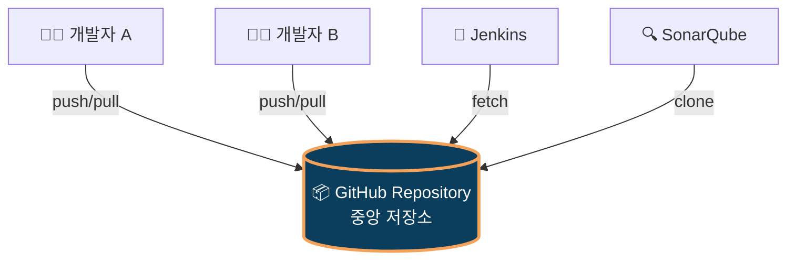
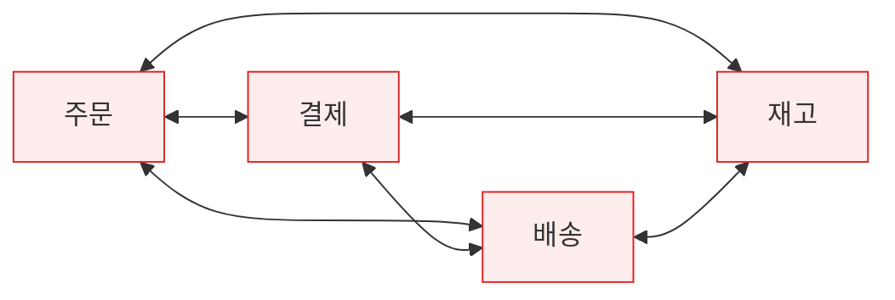
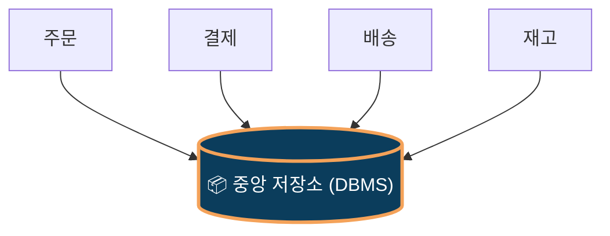
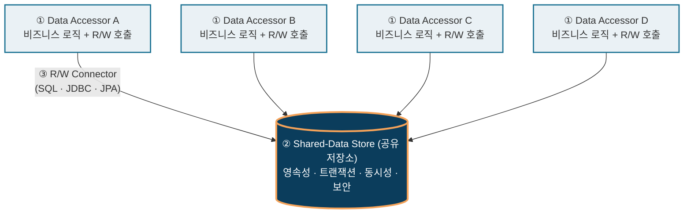
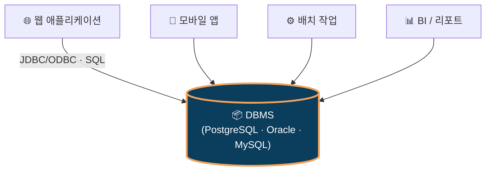
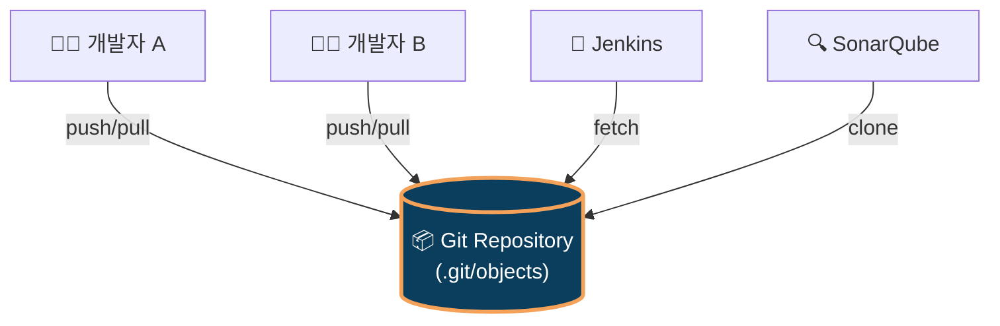

# Repository Style (저장소 스타일)

> **SW아키텍처설계_2604_양광모**
>
> Reference: Bass · Clements · Kazman, *Software Architecture in Practice* (3rd ed.), Ch.13 — Shared-Data Pattern

---

## 📑 목차

1. [개요](#1-개요)
2. [필요성](#2-필요성)
3. [구조](#3-구조)
4. [적용 사례](#4-적용-사례)
5. [장단점](#5-장단점)

---

## 1. 개요

### 🎯 한 줄 정의

> **"중앙에 공유 저장소를 두고, 모든 컴포넌트가 그 저장소를 통해서만 데이터를 주고받는 아키텍처 스타일"**

### 💻 직관적 비유 — GitHub



- 모든 도구가 **하나의 저장소만 바라봄** → Repository Style의 본질
- 개발자끼리 USB로 코드 주고받지 않음 → 항상 일치 보장됨

### 1.1 Summary

- *Software Architecture in Practice* 3판의 **Shared-Data Pattern**과 동일함
- **C&C(Component-and-Connector) 뷰**의 대표 패턴임
- 영속성·일관성·동시성을 저장소가 일괄 책임짐
- 가장 흔한 구현은 DBMS 중심 아키텍처임

### 1.2 Context · Problem · Solution

| 구분 | 내용 |
|---|---|
| 📍 **Context** | 다수 컴포넌트가 같은 데이터를 공유·조작해야 함 |
| ❓ **Problem** | 누가 데이터를 보관할 것인가? 동시 접근 충돌은 어떻게 막을 것인가? |
| 💡 **Solution** | 중앙 저장소 배치, 접근자는 R/W 커넥터로만 접근. 저장소가 영속성·트랜잭션·보안 책임짐 |

---

## 2. 필요성

### 2.1 Before vs After

#### ❌ Before — 직접 통신 (n×(n-1)/2 문제)



→ 서비스 4개에 연결선 6개, 6개면 15개. 데이터 불일치·변경 영향 광범위함.

#### ✅ After — Repository 적용



→ 연결선 4개로 단순화. 단일 진실원(SSOT) 확보.

### 2.2 6가지 핵심 요소

| # | 요소 | 효과 |
|:---:|---|---|
| 1 | **데이터 영속성** | 시스템 재기동에도 데이터 유지됨 |
| 2 | **다중 컴포넌트 공유** | 결합도 저감됨 |
| 3 | **일관성·무결성** | ACID·제약조건 일원화됨 |
| 4 | **동시성 제어** | 락·MVCC·격리수준 통제됨 |
| 5 | **생산자-소비자 분리** | 신규 컴포넌트 추가 영향 최소화됨 |
| 6 | **보안·감사 일원화** | 정책 영향 범위 한 곳 수렴됨 |

---

## 3. 구조

### 3.1 3대 구성요소



### 3.2 Data Accessor의 4가지 역할

| 역할 | 설명 | Spring 매핑 |
|---|---|---|
| ① **Read** | 저장소 데이터 조회 | `findById()`, `findAll()` |
| ② **Write** | 저장소에 데이터 기록 | `save()`, `delete()` |
| ③ **트랜잭션 경계** | 시작·커밋·롤백 결정 | `@Transactional` |
| ④ **추상화 계층** | 저장소 기술 변경 시 응용 보호 | `JpaRepository` 인터페이스 |

### 3.3 코드 매핑 (Spring Boot)

> 3.1의 **3대 구성요소**가 Spring 코드의 어디에 있는지 1:1로 매핑.

```java
// ══════════════════════════════════════════════════════
//  Data Accessor  (비즈니스 로직 + 저장소 호출)
// ══════════════════════════════════════════════════════
@Service
public class DeclarationService {
    private final DeclarationRepository repository;

    @Transactional
    public void submit(Declaration dec) {
        repository.save(dec);                                  // Write
        Declaration saved = repository.findById(dec.getId());  // Read
    }
}

public interface DeclarationRepository
        extends JpaRepository<Declaration, Long> {}
//  ⚠️ 클래스명이 "Repository"지만 Repository **Style**의
//     "저장소"가 아니라 Data Accessor의 추상화 계층임 (3.4 참조)
```

```yaml
# ══════════════════════════════════════════════════════
#  R/W Connector  (저장소 접속 설정 — application.yml)
# ══════════════════════════════════════════════════════
spring:
  datasource:
    url: jdbc:postgresql://db.host:5432/customs
    driver-class-name: org.postgresql.Driver
```

```text
══════════════════════════════════════════════════════
 Shared-Data Store  (외부 PostgreSQL 인스턴스 자체)
══════════════════════════════════════════════════════
```

| 3대 구성요소 | Spring Boot 위치 |
|---|---|
| **Data Accessor** | `@Service` 클래스 + `JpaRepository` 인터페이스 |
| **R/W Connector** | `application.yml`의 `spring.datasource.*` |
| **Shared-Data Store** | 외부 PostgreSQL 인스턴스 (코드 밖) |

### 3.4 ⚠️ 용어 혼동 주의

| 구분 | Repository **Style** (아키텍처) | Repository **Pattern** (DDD/Spring) |
|---|---|---|
| 출처 | Bass·Clements·Kazman *SAIP* | Eric Evans *DDD* (2003) |
| 레벨 | 시스템 레벨 | 코드 레벨 |
| "Repository" 의미 | **공유 저장소 자체** (DB) | **DB 접근 추상화 인터페이스** |
| C&C 매핑 | `Shared-Data Store` | `Data Accessor`의 일부 |
| 실제 예 | PostgreSQL, Oracle | `JpaRepository<T, ID>` |

→ `XxxRepository`는 **Data Accessor**임. 진짜 저장소는 그 뒤의 **PostgreSQL** 자체임.

---

## 4. 적용 사례

### 4.1 ⭐ 일반적 DBMS 구성 — Repository Style의 표준 구현

> 가장 보편적인 사례: **다종 클라이언트가 단일 DBMS를 공유 저장소로 사용**.



| Style 요소 | DBMS에서의 대응 |
|---|---|
| Shared-Data Store | DBMS 인스턴스 (PostgreSQL, Oracle, MySQL …) |
| Data Accessor | 클라이언트 애플리케이션 (웹·모바일·배치·BI) |
| R/W Connector | JDBC/ODBC, SQL |
| 영속성 | 디스크 + WAL |
| 동시성 제어 | 트랜잭션 격리 수준, MVCC, 락 |
| 접근 제어 | DB 사용자·권한·롤 |
| 감사 | DBMS 감사로그 |

### 4.2 ⭐ Git / GitHub — 이름 자체가 "Repository"



| Style 요소 | Git에서의 대응 |
|---|---|
| Shared-Data Store | Git Repository (`.git/objects`) |
| Data Accessor | 개발자, IDE, CI/CD, 정적분석 도구 |
| R/W Connector | `git push/pull/fetch/clone` |
| 영속성 | 커밋 이력 영구 보관 |
| 동시성 제어 | 브랜치·머지·충돌 해결 |
| 접근 제어 | SSH 키, PAT, 권한 관리 |
| 감사 | `git log`, `git blame` |

---

## 5. 장단점

### 5.1 장점 (Pros)

| # | 장점 | 효과 |
|:---:|---|---|
| 1 | 데이터 일관성 확보 용이 | Single Source of Truth |
| 2 | 수정 용이성(Modifiability) 향상 | 신규 컴포넌트 추가 영향 작음 |
| 3 | 트랜잭션 관리 단순화 | ACID는 DB가 책임짐 |
| 4 | 성능 튜닝 집중화 | 한 곳 튜닝으로 전체 개선 |
| 5 | 보안·감사 일원화 | 정책 영향 한 곳 수렴 |
| 6 | 표준 도구 활용 | RDBMS·NoSQL 생태계 활용 |

### 5.2 단점 (Cons) + ⭐ 해결 방법

| # | 단점 | 해결 방법 |
|:---:|---|---|
| 1 | **성능 병목** | 캐싱(Redis), Read Replica, 인덱스 최적화, **CQRS** |
| 2 | **단일 장애점(SPOF)** | HA 클러스터링, 복제, 자동 페일오버 |
| 3 | **생산자-소비자 결합** | View/API 추상화, Bounded Context 분리, 이벤트 기반 통신 |
| 4 | **확장성 제한** | **샤딩(Sharding)**, 파티셔닝, 분산 DB, Database-per-Service |
| 5 | **분산 트랜잭션 복잡** | **Saga**, Outbox, Eventual Consistency, Idempotency |
| 6 | **스키마 진화 어려움** | Flyway/Liquibase, **Expand-Contract**, Backward Compatible |

> 💡 **단점은 피할 수 없으나, 패턴(CQRS·Saga·Sharding)과 도구(캐시·복제·마이그레이션)로 충분히 완화 가능함**
