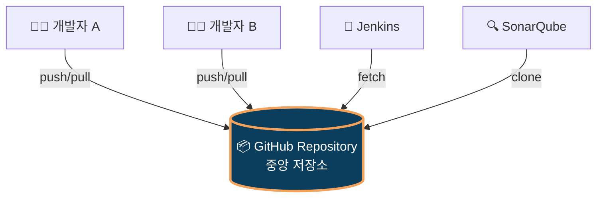
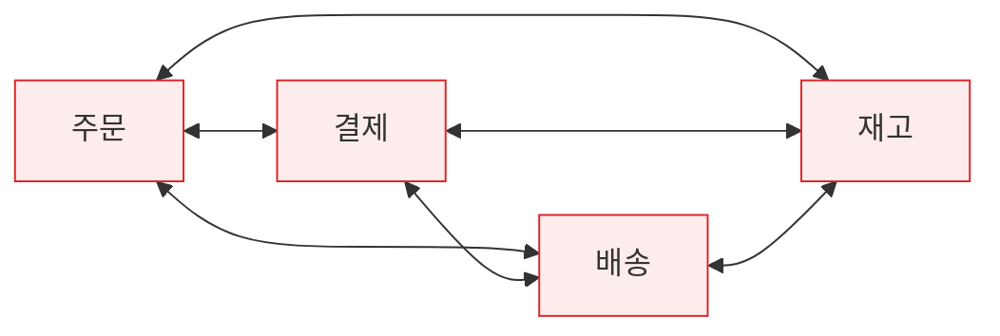
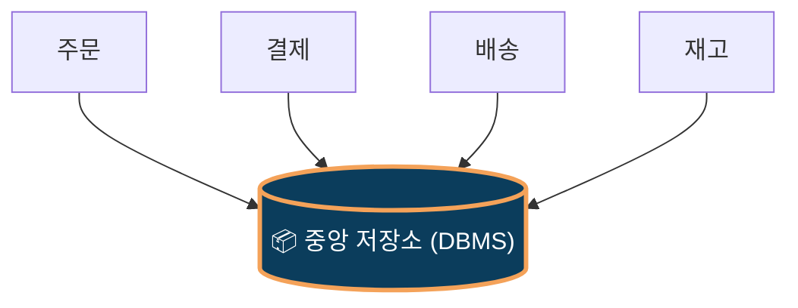
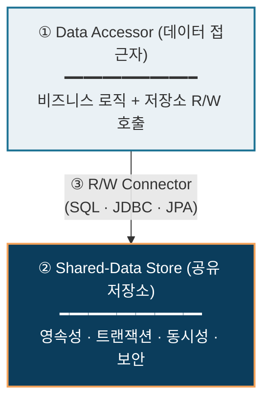
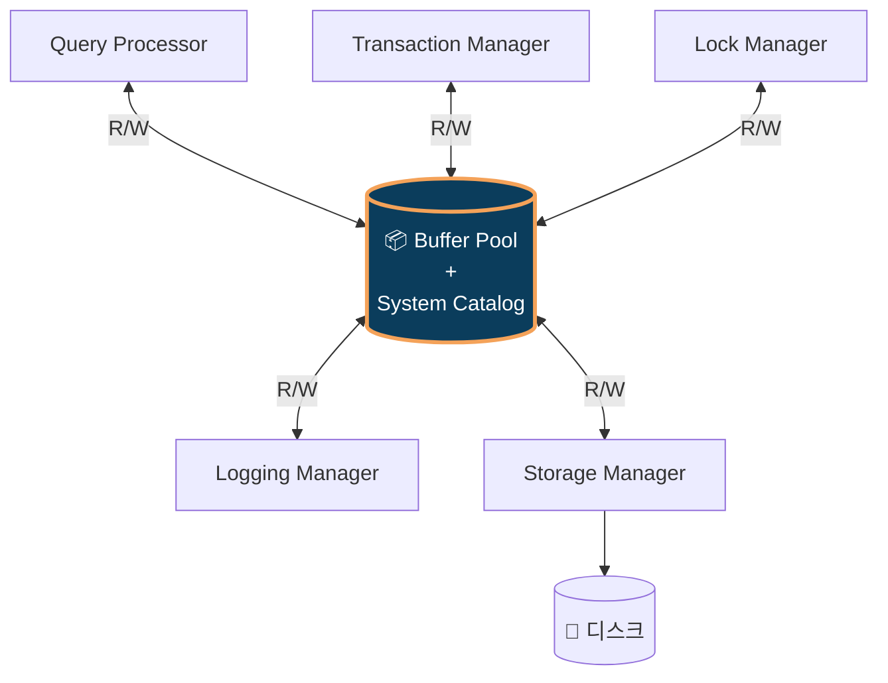
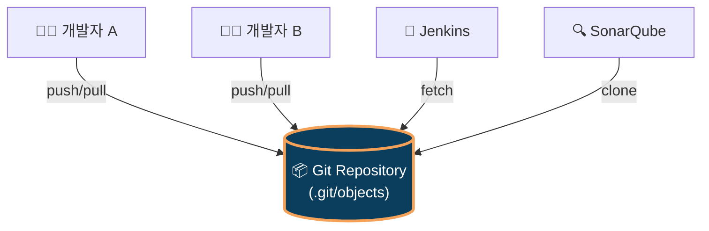

# Repository Style (저장소 스타일)

> **SW아키텍처설계_2604_양광모**
>
> Reference: Bass · Clements · Kazman, *Software Architecture in Practice* (3rd ed.), Ch.13 — Shared-Data Pattern

---

## 📑 목차

1. [개요](#1-개요)
2. [필요성](#2-필요성)
3. [구조](#3-구조)
4. [적용 사례](#4-적용-사례)
5. [장단점](#5-장단점)
6. [기타](#6-기타)

---

## 1. 개요

### 🎯 한 줄 정의

> **"중앙에 공유 저장소를 두고, 모든 컴포넌트가 그 저장소를 통해서만 데이터를 주고받는 아키텍처 스타일"**

### 💻 직관적 비유 — GitHub



- 모든 도구가 **하나의 저장소만 바라봄** → Repository Style의 본질
- 개발자끼리 USB로 코드 주고받지 않음 → 항상 일치 보장됨

### 1.1 Summary

- *Software Architecture in Practice* 3판의 **Shared-Data Pattern**과 동일함
- **C&C(Component-and-Connector) 뷰**의 대표 패턴임
- 영속성·일관성·동시성을 저장소가 일괄 책임짐
- 가장 흔한 구현은 DBMS 중심 아키텍처임

### 1.2 Context · Problem · Solution

| 구분 | 내용 |
|---|---|
| 📍 **Context** | 다수 컴포넌트가 같은 데이터를 공유·조작해야 함 |
| ❓ **Problem** | 누가 데이터를 보관할 것인가? 동시 접근 충돌은 어떻게 막을 것인가? |
| 💡 **Solution** | 중앙 저장소 배치, 접근자는 R/W 커넥터로만 접근. 저장소가 영속성·트랜잭션·보안 책임짐 |

---

## 2. 필요성

### 2.1 Before vs After

#### ❌ Before — 직접 통신 (n×(n-1)/2 문제)



→ 서비스 4개에 연결선 6개, 6개면 15개. 데이터 불일치·변경 영향 광범위함.

#### ✅ After — Repository 적용



→ 연결선 4개로 단순화. 단일 진실원(SSOT) 확보.

### 2.2 6가지 핵심 동인

| # | 동인 | 효과 |
|:---:|---|---|
| 1 | **데이터 영속성** | 시스템 재기동에도 데이터 유지됨 |
| 2 | **다중 컴포넌트 공유** | 결합도 저감됨 |
| 3 | **일관성·무결성** | ACID·제약조건 일원화됨 |
| 4 | **동시성 제어** | 락·MVCC·격리수준 통제됨 |
| 5 | **생산자-소비자 분리** | 신규 컴포넌트 추가 영향 최소화됨 |
| 6 | **보안·감사 일원화** | 정책 영향 범위 한 곳 수렴됨 |

---

## 3. 구조

### 3.1 3대 구성요소



### 3.2 Data Accessor의 4가지 역할

| 역할 | 설명 | Spring 매핑 |
|---|---|---|
| ① **Read** | 저장소 데이터 조회 | `findById()`, `findAll()` |
| ② **Write** | 저장소에 데이터 기록 | `save()`, `delete()` |
| ③ **트랜잭션 경계** | 시작·커밋·롤백 결정 | `@Transactional` |
| ④ **추상화 계층** | 저장소 기술 변경 시 응용 보호 | `JpaRepository` 인터페이스 |

### 3.3 코드 매핑 (Spring Boot)

```java
// ① 비즈니스 로직 (Data Accessor)
@Service
public class DeclarationService {
    private final DeclarationRepository repository;

    @Transactional
    public void submit(Declaration dec) {
        repository.save(dec);                              // Write
        Declaration saved = repository.findById(dec.getId());  // Read
    }
}

// ② 저장소 접근 추상화 (Data Accessor의 일부)
//    ⚠️ 이름은 "Repository"지만 Style의 "저장소"가 아님!
public interface DeclarationRepository extends JpaRepository<Declaration, Long> {}

// 📦 진짜 Shared-Data Store는 application.yml에:
//    spring.datasource.url: jdbc:postgresql://db.host:5432/customs
//    (실제 PostgreSQL 인스턴스가 진짜 저장소)
```

### 3.4 ⚠️ 용어 혼동 주의

| 구분 | Repository **Style** (아키텍처) | Repository **Pattern** (DDD/Spring) |
|---|---|---|
| 출처 | Bass·Clements·Kazman *SAIP* | Eric Evans *DDD* (2003) |
| 레벨 | 시스템 레벨 | 코드 레벨 |
| "Repository" 의미 | **공유 저장소 자체** (DB) | **DB 접근 추상화 인터페이스** |
| C&C 매핑 | `Shared-Data Store` | `Data Accessor`의 일부 |
| 실제 예 | PostgreSQL, Oracle | `JpaRepository<T, ID>` |

→ `XxxRepository`는 **Data Accessor**임. 진짜 저장소는 그 뒤의 **PostgreSQL** 자체임.

---

## 4. 적용 사례

### 4.1 ⭐ DBMS 내부 구성 — 가장 본질적 사례

> 외부 사용 사례 외에도, **DBMS 자체의 내부 아키텍처**가 Repository Style의 결정체임



**Repository Style인 이유**:
- 내부 컴포넌트가 **공유 메모리(Buffer Pool)**를 매개로 협력함
- 직접 통신하지 않고 저장소를 통해서만 협력함

### 4.2 ⭐ Git / GitHub — 이름 자체가 "Repository"



| Style 요소 | Git에서의 대응 |
|---|---|
| Shared-Data Store | Git Repository (`.git/objects`) |
| Data Accessor | 개발자, IDE, CI/CD, 정적분석 도구 |
| R/W Connector | `git push/pull/fetch/clone` |
| 영속성 | 커밋 이력 영구 보관 |
| 동시성 제어 | 브랜치·머지·충돌 해결 |
| 접근 제어 | SSH 키, PAT, 권한 관리 |
| 감사 | `git log`, `git blame` |

### 4.3 그 외 사례

| 사례 | 핵심 |
|---|---|
| **이커머스** (쿠팡·아마존) | 웹·앱·관리자·추천이 단일 상품·주문 DB 공유 |
| **컴파일러** | Lexer→Parser→CodeGen이 Symbol Table·AST 공유 (고전적) |
| **Blackboard** (능동형 변형) | AI·음성인식 — 저장소가 접근자에게 능동 통지 (HEARSAY-II) |

---

## 5. 장단점

### 5.1 장점 (Pros)

| # | 장점 | 효과 |
|:---:|---|---|
| 1 | 데이터 일관성 확보 용이 | Single Source of Truth |
| 2 | 수정 용이성(Modifiability) 향상 | 신규 컴포넌트 추가 영향 작음 |
| 3 | 트랜잭션 관리 단순화 | ACID는 DB가 책임짐 |
| 4 | 성능 튜닝 집중화 | 한 곳 튜닝으로 전체 개선 |
| 5 | 보안·감사 일원화 | 정책 영향 한 곳 수렴 |
| 6 | 표준 도구 활용 | RDBMS·NoSQL 생태계 활용 |

### 5.2 단점 (Cons) + ⭐ 해결 방법

| # | 단점 | 해결 방법 |
|:---:|---|---|
| 1 | **성능 병목** | 캐싱(Redis), Read Replica, 인덱스 최적화, **CQRS** |
| 2 | **단일 장애점(SPOF)** | HA 클러스터링, 복제, 자동 페일오버, Multi-AZ |
| 3 | **생산자-소비자 결합** | View/API 추상화, Bounded Context 분리, 이벤트 기반 통신 |
| 4 | **확장성 제한** | **샤딩(Sharding)**, 파티셔닝, 분산 DB, Database-per-Service |
| 5 | **분산 트랜잭션 복잡** | **Saga**, Outbox, Eventual Consistency, Idempotency |
| 6 | **스키마 진화 어려움** | Flyway/Liquibase, **Expand-Contract**, Backward Compatible |

> 💡 **단점은 피할 수 없으나, 패턴(CQRS·Saga·Sharding)과 도구(캐시·복제·마이그레이션)로 충분히 완화 가능함**

---

## 6. 기타

### 6.1 Repository vs Blackboard

| 구분 | Repository (수동형) | Blackboard (능동형) |
|---|---|---|
| **제어 주체** | 접근자가 시작 | 저장소가 통지 |
| **데이터 모델** | RDB/문서/KV 자유로움 | 구조화된 지식 단위 |
| **적합 영역** | OLTP/OLAP, 일반 시스템 | AI, 휴리스틱 협업 |
| **대표 사례** | RDBMS, ERP, **Git** | HEARSAY-II, AI 추론엔진 |

### 6.2 현대적 진화

```
   1990s         2000s          2010s          2020s
   ──────────────────────────────────────────────────────
   단일 RDB  →  RDB+Cache  →  NoSQL 혼합  →  CQRS+ES+Mesh
```

| 진화 패턴 | 설명 |
|---|---|
| **NoSQL · Polyglot Persistence** | 용도별 저장소 분산 (RDB+문서+KV+시계열) |
| **Event Sourcing** | 상태가 아닌 **이벤트**를 영속화 → 이력 추적 가능 |
| **CQRS** | 쓰기·읽기 모델 분리로 병목 완화 |
| **Data Mesh** | 도메인별 데이터 소유, 중앙 집중 한계 극복 |
| **Database-per-Service** | MSA: 서비스마다 자체 저장소 |

### 6.3 추가 고려사항

- **Repository ≠ Database** — 메모리(Buffer Pool), 파일시스템(Git), 객체저장소(S3), KV(Redis) 모두 가능함. 핵심은 "**중앙에서 데이터 보관, 다수가 공유**"라는 구조임
- **클라우드 시대** — Managed Service(AWS RDS, Aurora Serverless)로 SPOF·HA 부담 경감되나, **벤더 종속성**과 비용 제어가 새 과제임

### 6.4 설계 시 체크리스트

- [ ] SPOF 대응 (HA·복제·페일오버)
- [ ] 성능 병목 예측 및 캐싱·복제 전략
- [ ] 스키마 변경 거버넌스 (Migration 절차)
- [ ] 트랜잭션 경계와 격리 수준
- [ ] 보안·감사 정책 저장소 계층 적용
- [ ] 백업·복구·DR(재해복구) 전략
- [ ] 미래 CQRS·Event Sourcing 전환 가능성

---

## 📚 참고문헌

| # | 문헌 |
|---|---|
| 1 | Bass, L., Clements, P., Kazman, R. *Software Architecture in Practice* (3rd ed.). Addison-Wesley, 2012. — Ch.13 Shared-Data Pattern |
| 2 | Evans, E. *Domain-Driven Design*. Addison-Wesley, 2003. — Repository Pattern |
| 3 | Fowler, M. *Patterns of Enterprise Application Architecture*. Addison-Wesley, 2002. |
| 4 | Buschmann, F. et al. *Pattern-Oriented Software Architecture, Vol.1*. Wiley, 1996. — Blackboard Pattern |
