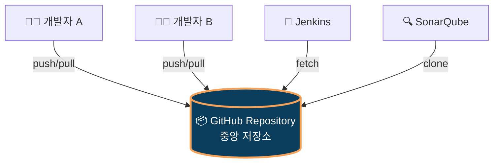
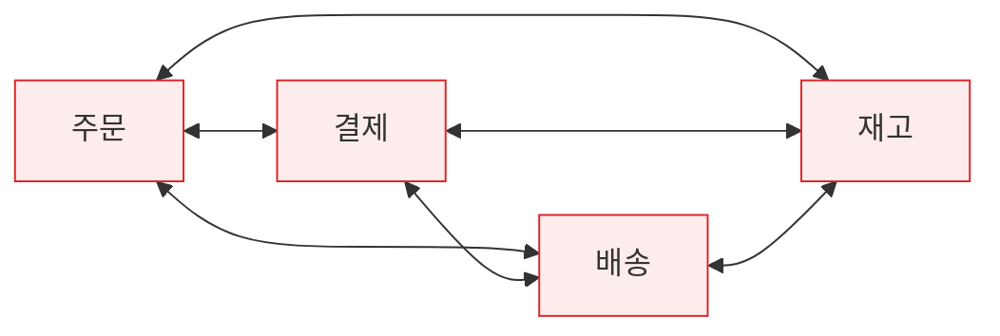
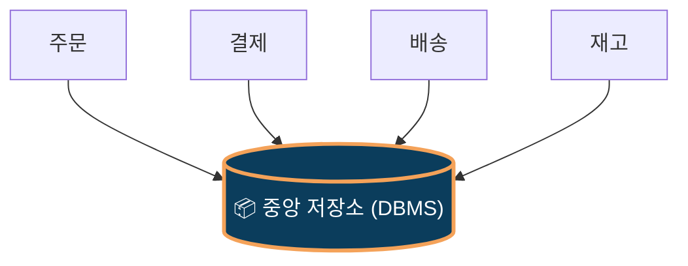
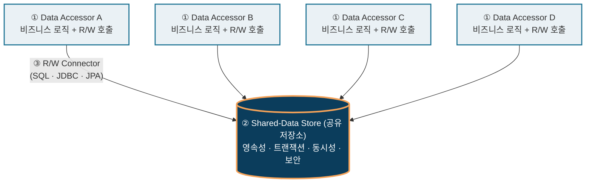
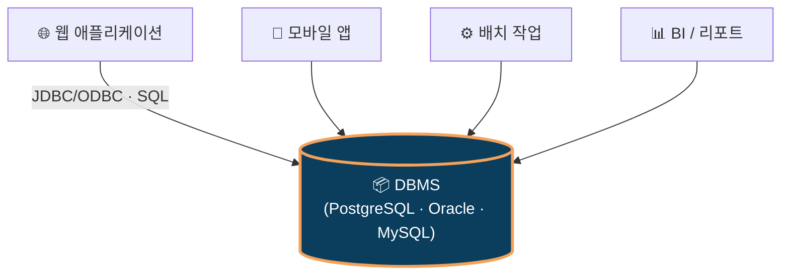
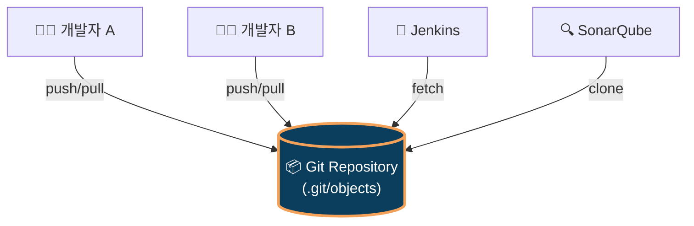

# Repository Style (저장소 스타일)

> **SW아키텍처설계*2604*양광모**
>
> Reference: Bass · Clements · Kazman, _Software Architecture in Practice_ (3rd ed.), Ch.13 — Shared-Data Pattern

---

## 📑 목차

1. [개요](#1-개요)
2. [필요성](#2-필요성)
3. [구조](#3-구조)
4. [적용 사례](#4-적용-사례)
5. [장단점](#5-장단점)

---

## 1. 개요

### 🎯 한 줄 정의

> **"중앙에 공유 저장소를 두고, 모든 컴포넌트가 그 저장소를 통해서만 데이터를 주고받는 아키텍처 스타일"**

<details open>
<summary><strong>🎤 발표 스크립트 — 약 25초</strong></summary>

<br/>

Repository Style이라는 소프트웨어 아키텍처 패턴을 설명하겠습니다.

이 패턴을 한 줄로 정의하면 — **"중앙에 공유 저장소를 두고, 모든 컴포넌트가 그 저장소를 통해서만 데이터를 주고받는 구조"** 입니다.

</details>

### 💻 직관적 비유 — GitHub



- 모든 도구가 **하나의 저장소만 바라봄** → Repository Style의 본질
- 개발자끼리 USB로 코드 주고받지 않음 → 항상 일치 보장됨

<details open>
<summary><strong>🎤 발표 스크립트 — 약 35초</strong></summary>

<br/>

가장 직관적인 비유는 우리가 매일 쓰는 **GitHub/Gitlab**과 같은 버전 컨트롤 시스템입니다.

개발자 여러 명이 소스코드를 공유할 때 파일로 직접 코드를 주고받지는 않고 모두 하나의 Repository를 바라보고 push, pull 합니다.

Jenkins나 SonarQube 같은 자동화 도구도 같은 저장소를 fetch, clone 합니다.

**모든 도구가 단 하나의 저장소만 바라본다** — 이게 Repository Style의 본질입니다.

</details>

### 1.1 Summary

- _Software Architecture in Practice_ 3판의 **Shared-Data Pattern**과 동일함
- **C&C(Component-and-Connector) 뷰**의 대표 패턴임
- 영속성·일관성·동시성을 저장소가 일괄 책임짐
- 가장 흔한 구현은 DBMS 중심 아키텍처임

<details open>
<summary><strong>🎤 발표 스크립트 — 약 25초</strong></summary>

<br/>

이 패턴은 _Software Architecture in Practice_ 3판에서 **Shared-Data Pattern**이라는 이름으로 다뤄진다고 한다.
영속성·일관성·동시성을 저장소가 일괄 책임집니다.
가장 흔한 구현 형태는 **DBMS 중심 아키텍처**입니다.

</details>

### 1.2 Context · Problem · Solution

| 구분            | 내용                                                                                 |
| --------------- | ------------------------------------------------------------------------------------ |
| 📍 **Context**  | 다수 컴포넌트가 같은 데이터를 공유·조작해야 함                                       |
| ❓ **Problem**  | 누가 데이터를 보관할 것인가? 동시 접근 충돌은 어떻게 막을 것인가?                    |
| 💡 **Solution** | 중앙 저장소 배치, 접근자는 R/W 커넥터로만 접근. 저장소가 영속성·트랜잭션·보안 책임짐 |

<details open>
<summary><strong>🎤 발표 스크립트 — 약 25초</strong></summary>

<br/>

좀 더 구조적으로 보면, **Context-Problem-Solution** 형식으로 정리할 수 있습니다.

**Context**는 여러 컴포넌트가 같은 데이터를 공유·조작해야 하는 상황입니다. **Problem**은 "누가 데이터를 보관할 것이고, 동시 접근 충돌은 어떻게 막을 것인가"라는 질문이고요.

**Solution**은 중앙 저장소를 두고, 접근자는 R/W 커넥터로만 접근하게 하는 구조입니다. 영속성·트랜잭션·보안은 저장소가 책임집니다.

</details>

---

## 2. 필요성

### 2.1 Before vs After

#### ❌ Before — 직접 통신 (n×(n-1)/2 문제)



→ 서비스 4개에 연결선 6개, 6개면 15개. 데이터 불일치·변경 영향 광범위함.

#### ✅ After — Repository 적용



→ 연결선 4개로 단순화. 단일 진실원(SSOT) 확보.

<details open>
<summary><strong>🎤 발표 스크립트 — 약 1분</strong></summary>

<br/>

이 패턴이 왜 필요한지, **Before / After 비교**로 시작하겠습니다.

**Before** 구조에서는 컴포넌트들이 직접 데이터를 주고받습니다. 슬라이드처럼 주문·결제·배송·재고 4개 서비스가 서로 엇갈려 연결되죠. 이게 **n×(n−1)/2 폭증 문제**입니다.

서비스 4개면 6개 연결선, 6개로 늘면 15개로 폭증합니다. 한 곳을 바꾸면 연결된 모든 서비스에 영향이 가고, 데이터 불일치도 빈번해지죠.

**After**, Repository Style을 적용하면 모든 서비스가 **중앙 저장소 하나만** 바라봅니다. 연결선이 4개로 단순화되고, **단일 진실원, 즉 SSOT(Single Source of Truth)**가 자연스럽게 확보됩니다.

</details>

### 2.2 6가지 핵심 요소

|  #  | 요소                   | 효과                             |
| :-: | ---------------------- | -------------------------------- |
|  1  | **데이터 영속성**      | 시스템 재기동에도 데이터 유지됨  |
|  2  | **다중 컴포넌트 공유** | 결합도 저감됨                    |
|  3  | **일관성·무결성**      | ACID·제약조건 일원화됨           |
|  4  | **동시성 제어**        | 락·MVCC·격리수준 통제됨          |
|  5  | **생산자-소비자 분리** | 신규 컴포넌트 추가 영향 최소화됨 |
|  6  | **보안·감사 일원화**   | 정책 영향 범위 한 곳 수렴됨      |

<details open>
<summary><strong>🎤 발표 스크립트 — 약 1분</strong></summary>

<br/>

이 패턴이 가져오는 효과를 6가지로 정리했습니다.

첫째, **데이터 영속성** — 재기동에도 데이터가 살아남습니다.

둘째, **다중 컴포넌트 공유**로 결합도가 낮아집니다.

셋째, **일관성·무결성** — ACID와 제약 조건이 일원화됩니다.

넷째, **동시성 제어** — 락, MVCC, 격리 수준이 통제됩니다.

다섯째, **생산자-소비자 분리**로 새 컴포넌트 추가 영향이 최소화됩니다.

여섯째, **보안·감사 일원화** — 정책 영향 범위가 한 곳으로 수렴됩니다.

요약하면 Repository Style은, **"직접 통신의 폭증·불일치 문제"를 "중앙 집중·SSOT"로 해결**하는 패턴입니다.

</details>

---

## 3. 구조

### 3.1 3대 구성요소



<details open>
<summary><strong>🎤 발표 스크립트 — 약 50초</strong></summary>

<br/>

이제 **Repository Style의 구조**를 살펴보겠습니다. 핵심 구성요소는 세 가지입니다.

첫째, **Data Accessor (데이터 접근자)** — 비즈니스 로직과 저장소 R/W 호출을 담당합니다. 슬라이드 그림에서 위쪽의 A·B·C·D 4개 박스가 이에 해당하고요, **여러 개일 수 있다**는 점이 중요합니다.

둘째, **Shared-Data Store (공유 저장소)** — 가운데 진하게 표시된 박스로, 영속성·트랜잭션·동시성·보안을 책임집니다.

셋째, **R/W Connector** — 둘을 잇는 화살표로, SQL이나 JDBC, JPA 같은 기술이 여기에 해당합니다.

</details>

### 3.2 Data Accessor의 4가지 역할

| 역할                | 설명                          | Spring 매핑                |
| ------------------- | ----------------------------- | -------------------------- |
| ① **Read**          | 저장소 데이터 조회            | `findById()`, `findAll()`  |
| ② **Write**         | 저장소에 데이터 기록          | `save()`, `delete()`       |
| ③ **트랜잭션 경계** | 시작·커밋·롤백 결정           | `@Transactional`           |
| ④ **추상화 계층**   | 저장소 기술 변경 시 응용 보호 | `JpaRepository` 인터페이스 |

<details open>
<summary><strong>🎤 발표 스크립트 — 약 30초</strong></summary>

<br/>

다음으로 Data Accessor가 구체적으로 어떤 일을 하는지 보겠습니다. 4가지 역할이 있습니다 — **Read, Write, 트랜잭션 경계, 추상화 계층**.

Spring Boot로 매핑하면 `findById`·`save`가 Read·Write에, `@Transactional`이 트랜잭션 경계에, `JpaRepository` 인터페이스가 추상화 계층에 해당합니다.

</details>

### 3.3 코드 매핑 (Spring Boot)

> 3.1의 **3대 구성요소**가 Spring 코드의 어디에 있는지 1:1로 매핑.

```java
// ══════════════════════════════════════════════════════
//  Data Accessor  (비즈니스 로직 + 저장소 호출)
// ══════════════════════════════════════════════════════
@Service
public class DeclarationService {
    private final DeclarationRepository repository;

    @Transactional
    public void submit(Declaration dec) {
        repository.save(dec);                                  // Write
        Declaration saved = repository.findById(dec.getId());  // Read
    }
}

public interface DeclarationRepository
        extends JpaRepository<Declaration, Long> {}
//  ⚠️ 클래스명이 "Repository"지만 Repository **Style**의
//     "저장소"가 아니라 Data Accessor의 추상화 계층임 (3.4 참조)
```

```yaml
# ══════════════════════════════════════════════════════
#  R/W Connector  (저장소 접속 설정 — application.yml)
# ══════════════════════════════════════════════════════
spring:
  datasource:
    url: jdbc:postgresql://db.host:5432/customs
    driver-class-name: org.postgresql.Driver
```

```text
══════════════════════════════════════════════════════
 Shared-Data Store  (외부 PostgreSQL 인스턴스 자체)
══════════════════════════════════════════════════════
```

| 3대 구성요소          | Spring Boot 위치                               |
| --------------------- | ---------------------------------------------- |
| **Data Accessor**     | `@Service` 클래스 + `JpaRepository` 인터페이스 |
| **R/W Connector**     | `application.yml`의 `spring.datasource.*`      |
| **Shared-Data Store** | 외부 PostgreSQL 인스턴스 (코드 밖)             |

<details open>
<summary><strong>🎤 발표 스크립트 — 약 35초</strong></summary>

<br/>

이걸 실제 Spring Boot 코드로 보면 더 명확해집니다.

`@Service` 클래스와 `JpaRepository` 인터페이스가 묶여서 **Data Accessor**를 형성하고, `application.yml`의 `datasource.url` 설정이 **R/W Connector** 역할을 합니다.

그리고 그 끝에 있는 외부 PostgreSQL 인스턴스가 **Shared-Data Store**, 즉 진짜 저장소입니다. **진짜 저장소는 코드 밖에 있다** — 이게 핵심 포인트입니다.

</details>

### 3.4 ⚠️ 용어 혼동 주의

| 구분              | Repository **Style** (아키텍처) | Repository **Pattern** (DDD/Spring) |
| ----------------- | ------------------------------- | ----------------------------------- |
| 출처              | Bass·Clements·Kazman _SAIP_     | Eric Evans _DDD_ (2003)             |
| 레벨              | 시스템 레벨                     | 코드 레벨                           |
| "Repository" 의미 | **공유 저장소 자체** (DB)       | **DB 접근 추상화 인터페이스**       |
| C&C 매핑          | `Shared-Data Store`             | `Data Accessor`의 일부              |
| 실제 예           | PostgreSQL, Oracle              | `JpaRepository<T, ID>`              |

→ `XxxRepository`는 **Data Accessor**임. 진짜 저장소는 그 뒤의 **PostgreSQL** 자체임.

<details open>
<summary><strong>🎤 발표 스크립트 — 약 35초</strong></summary>

<br/>

마지막으로 가장 헷갈리기 쉬운 부분, **용어 혼동 주의**입니다.

Spring이나 DDD의 Repository **Pattern**은 **코드 레벨**의 추상화 인터페이스를 가리키는 반면, 우리가 다루는 Repository **Style**의 "Repository"는 **시스템 레벨**의 진짜 저장소, 즉 PostgreSQL 같은 DB 자체를 가리킵니다.

이름은 같지만 **추상 수준이 다르다**는 점만 기억하시면 됩니다.

</details>

---

## 4. 적용 사례

### 4.1 ⭐ 일반적 DBMS 구성 — Repository Style의 표준 구현

> 가장 보편적인 사례: **다종 클라이언트가 단일 DBMS를 공유 저장소로 사용**.



| Style 요소        | DBMS에서의 대응                             |
| ----------------- | ------------------------------------------- |
| Shared-Data Store | DBMS 인스턴스 (PostgreSQL, Oracle, MySQL …) |
| Data Accessor     | 클라이언트 애플리케이션 (웹·모바일·배치·BI) |
| R/W Connector     | JDBC/ODBC, SQL                              |
| 영속성            | 디스크 + WAL                                |
| 동시성 제어       | 트랜잭션 격리 수준, MVCC, 락                |
| 접근 제어         | DB 사용자·권한·롤                           |
| 감사              | DBMS 감사로그                               |

<details open>
<summary><strong>🎤 발표 스크립트 — 약 1분</strong></summary>

<br/>

이제 적용 사례입니다. 두 가지 정수 사례를 준비했는데, 첫째가 **일반적인 DBMS 구성**입니다.

이건 Repository Style의 가장 표준적인 구현입니다. 슬라이드처럼 **웹 애플리케이션, 모바일 앱, 배치 작업, BI 리포트** 같은 다종 클라이언트가 모두 단일 DBMS를 공유 저장소로 사용합니다.

JDBC·ODBC가 R/W Connector이고, PostgreSQL이나 Oracle, MySQL이 Shared-Data Store입니다.

영속성은 디스크와 WAL이, 동시성 제어는 트랜잭션 격리 수준과 MVCC가, 접근 제어는 DB 사용자·권한·롤이 책임지죠.

즉 **우리가 일상적으로 쓰는 RDBMS 사용 패턴 자체가 Repository Style의 정수**입니다.

</details>

### 4.2 ⭐ Git / GitHub — 이름 자체가 "Repository"



| Style 요소        | Git에서의 대응                    |
| ----------------- | --------------------------------- |
| Shared-Data Store | Git Repository (`.git/objects`)   |
| Data Accessor     | 개발자, IDE, CI/CD, 정적분석 도구 |
| R/W Connector     | `git push/pull/fetch/clone`       |
| 영속성            | 커밋 이력 영구 보관               |
| 동시성 제어       | 브랜치·머지·충돌 해결             |
| 접근 제어         | SSH 키, PAT, 권한 관리            |
| 감사              | `git log`, `git blame`            |

<details open>
<summary><strong>🎤 발표 스크립트 — 약 1분</strong></summary>

<br/>

둘째 사례, **Git과 GitHub**입니다. 이건 이름 자체가 "Repository"죠.

개발자, IDE, CI/CD, 정적분석 도구 같은 다양한 Data Accessor가 단일 Git Repository, 즉 `.git/objects`라는 공유 저장소를 push, pull, fetch, clone으로 접근합니다.

영속성은 커밋 이력 영구 보관, 동시성 제어는 브랜치·머지·충돌 해결, 접근 제어는 SSH 키와 PAT, 감사는 `git log`와 `git blame`이 담당합니다.

두 사례를 비교해 보면, DBMS는 **매일 코드로 쓰는 사례**, Git은 **매일 커맨드로 쓰는 사례**입니다. 형태는 다르지만 **N:1 공유 구조와 책임 분담은 완벽히 동일**합니다.

Repository Style이 얼마나 보편적이고 실용적인 패턴인지 잘 보여주는 두 정수입니다.

</details>

---

## 5. 장단점

### 5.1 장점 (Pros)

|  #  | 장점                            | 효과                         |
| :-: | ------------------------------- | ---------------------------- |
|  1  | 데이터 일관성 확보 용이         | Single Source of Truth       |
|  2  | 수정 용이성(Modifiability) 향상 | 신규 컴포넌트 추가 영향 작음 |
|  3  | 트랜잭션 관리 단순화            | ACID는 DB가 책임짐           |
|  4  | 성능 튜닝 집중화                | 한 곳 튜닝으로 전체 개선     |
|  5  | 보안·감사 일원화                | 정책 영향 한 곳 수렴         |
|  6  | 표준 도구 활용                  | RDBMS·NoSQL 생태계 활용      |

<details open>
<summary><strong>🎤 발표 스크립트 — 약 50초</strong></summary>

<br/>

이제 마지막으로 **장단점**을 정리하겠습니다. 먼저 장점은 6가지입니다.

첫째, **데이터 일관성 확보**가 쉽습니다. 단일 진실원이 자동으로 보장되니까요.

둘째, **수정 용이성** — 새 컴포넌트를 추가해도 기존 코드 영향이 작습니다.

셋째, **트랜잭션 관리가 단순**해집니다. ACID는 DB가 책임지니까요.

넷째, **성능 튜닝이 집중화**됩니다 — 한 곳만 잘 튜닝하면 전체가 빨라집니다.

다섯째, **보안과 감사가 일원화**되고, 여섯째, **RDBMS와 NoSQL의 표준 도구 생태계**를 그대로 활용할 수 있습니다.

</details>

### 5.2 단점 (Cons) + ⭐ 해결 방법

|  #  | 단점                   | 해결 방법                                                   |
| :-: | ---------------------- | ----------------------------------------------------------- |
|  1  | **성능 병목**          | 캐싱(Redis), Read Replica, 인덱스 최적화, **CQRS**          |
|  2  | **단일 장애점(SPOF)**  | HA 클러스터링, 복제, 자동 페일오버                          |
|  3  | **생산자-소비자 결합** | View/API 추상화, Bounded Context 분리, 이벤트 기반 통신     |
|  4  | **확장성 제한**        | **샤딩(Sharding)**, 파티셔닝, 분산 DB, Database-per-Service |
|  5  | **분산 트랜잭션 복잡** | **Saga**, Outbox, Eventual Consistency, Idempotency         |
|  6  | **스키마 진화 어려움** | Flyway/Liquibase, **Expand-Contract**, Backward Compatible  |

> 💡 **단점은 피할 수 없으나, 패턴(CQRS·Saga·Sharding)과 도구(캐시·복제·마이그레이션)로 충분히 완화 가능함**

<details open>
<summary><strong>🎤 발표 스크립트 — 약 1분 10초</strong></summary>

<br/>

**단점**도 분명 존재합니다. 다만 중요한 건, **단점마다 명확한 해결 패턴이 있다**는 점입니다.

첫째, **성능 병목**은 캐싱(Redis), Read Replica, 인덱스 최적화, 그리고 **CQRS** 같은 패턴으로 풉니다.

둘째, **단일 장애점, SPOF**는 HA 클러스터링·복제·자동 페일오버로 막죠.

셋째, **생산자-소비자 결합**은 View나 API 추상화, Bounded Context 분리, 이벤트 기반 통신으로 완화합니다.

넷째, **확장성 제한**은 **샤딩(Sharding)**, 파티셔닝, 분산 DB, Database-per-Service로 해결합니다.

다섯째, **분산 트랜잭션 복잡성**은 **Saga**, Outbox, Eventual Consistency, Idempotency로 풉니다.

여섯째, **스키마 진화의 어려움**은 Flyway·Liquibase 같은 마이그레이션 도구와 **Expand-Contract** 패턴, Backward Compatible 설계로 대응합니다.

결론적으로, **단점은 피할 수 없지만 패턴과 도구로 충분히 완화 가능**합니다. 그래서 Repository Style은 지금까지도 가장 널리 쓰이는 아키텍처 패턴이 되었습니다.

이상으로 Repository Style 발표를 마치겠습니다. 감사합니다.

</details>
